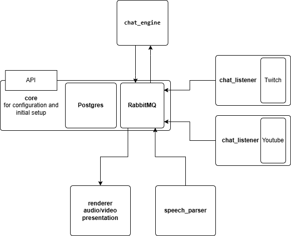

# VirtualArtist

## Description
ToDo

## Install
1) Create .env file with your settings:

```
APP_PORT=8000
DATABASE_URL=postgresql://user:password@db:5432/virtual_artist
POSTGRES_USER=test
POSTGRES_PASSWORD=test
POSTGRES_DB=virtual_artist
RABBITMQ_USER=test
RABBITMQ_PASSWORD=test
```

2) Run
```
docker-compose up --build
```

3) RabbitMQ dashboard:
```
http://localhost:15672
```

Core service:
```
http://localhost:8000
```

## Architectural overview
