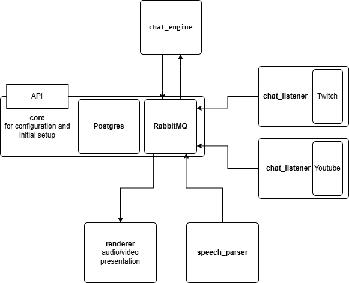

# 🎤 Виртуальный Артист на ИИ  

## 📌 Описание проекта  
**Виртуальный Артист** – это система, использующая искусственный интеллект для общения с аудиторией и исполнения песен в режиме реального времени. Проект сочетает в себе несколько микросервисов, обрабатывающих текст, голос и анимацию.  

## ⚙️ Технологии  
- **Язык:** Python (FastAPI)  
- **База данных:** PostgreSQL  
- **Очередь сообщений:** RabbitMQ  
- **Контейнеризация:** Docker, Docker Compose  
- **ИИ-модели:** ChatGPT (диалог), Whisper (распознавание речи), RVC (синтез голоса)  

## 🔧 Архитектура  
Проект построен на микросервисной архитектуре:  
- **`core`** – управление конфигурацией и инфраструктурой  
- **`chat_listener`** – сбор сообщений из Twitch/YouTube  
- **`speech_parser`** – преобразование речи в текст  
- **`chat_engine`** – обработка сообщений и генерация ответов  
- **`avatar_renderer`** – озвучивание и анимация аватара



## 🚀 Запуск проекта  
1. Склонируйте репозиторий:  
   ```bash
   git clone https://github.com/your-repo/virtual-artist.git
   cd virtual-artist
   ```
2. Создайте .env в корне проекта
   ```bash
   APP_PORT=8000
   DATABASE_URL=postgresql://user:password@db:5432/virtual_artist
   POSTGRES_USER=test
   POSTGRES_PASSWORD=test
   POSTGRES_DB=virtual_artist
   RABBITMQ_USER=test
   RABBITMQ_PASSWORD=test
   ```
2. Запустите контейнеры:  
   ```bash
   docker-compose up --build
   ```  
3. Откройте `http://localhost:8000/docs` для тестирования API. 
Откройте дашборд RabbitMQ `http://localhost:15672`.

## 📜 Лицензия  
MIT License 